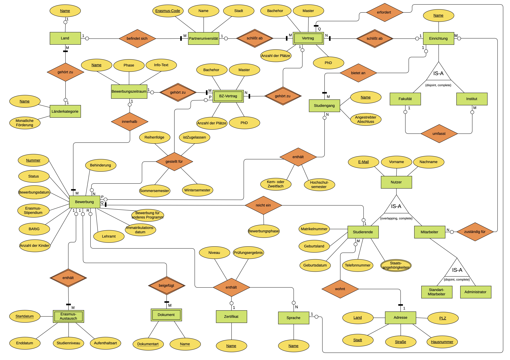

# Erasmus Semester Database Project

A database semester project for Erasmus semester planning with design and implementation details. The project covers requirements analysis, conceptual design (ER diagrams), logical design (relational model), data definition (SQL DDL statements), and sample SQL queries.

## Project Overview

The project follows a structured database design approach, going through various phases of database development:

1. **Requirements Analysis (Anforderungsanalyse)**: 
   - Use cases were identified to understand the functional requirements of the application, such as semester planning and student application management

2. **Conceptual Design (Konzeptueller Entwurf)**: 
   - The conceptual design phase includes creating Entity-Relationship (ER) diagrams that represent the main entities (universities, agreements,students, semesters, applications, etc.) and the relationships between them.

3. **Logical Design (Logischer Entwurf)**: 
   - The ER diagrams were translated into a relational model.
   - Determined the appropriate normal form for the database to eliminate redundancy.
   - Performed normalization if neccessary.

4. **Data Definition (Datendefinition)**: 
   - Used SQL DDL statements to create the database schema.
   - Defined primary keys, foreign keys, and relationships between tables.
   - Created SQL queries, including aggregation, joins, subqueries.

5. **Implementierung (Implementation)**:
   - Implemented the database in MySQL with necessary tables and relationships.
   - Tested by executing sample SQL queries.

## ER(Entity-Relationship) Diagram

